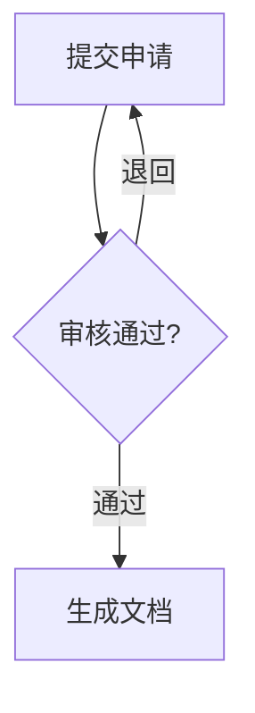
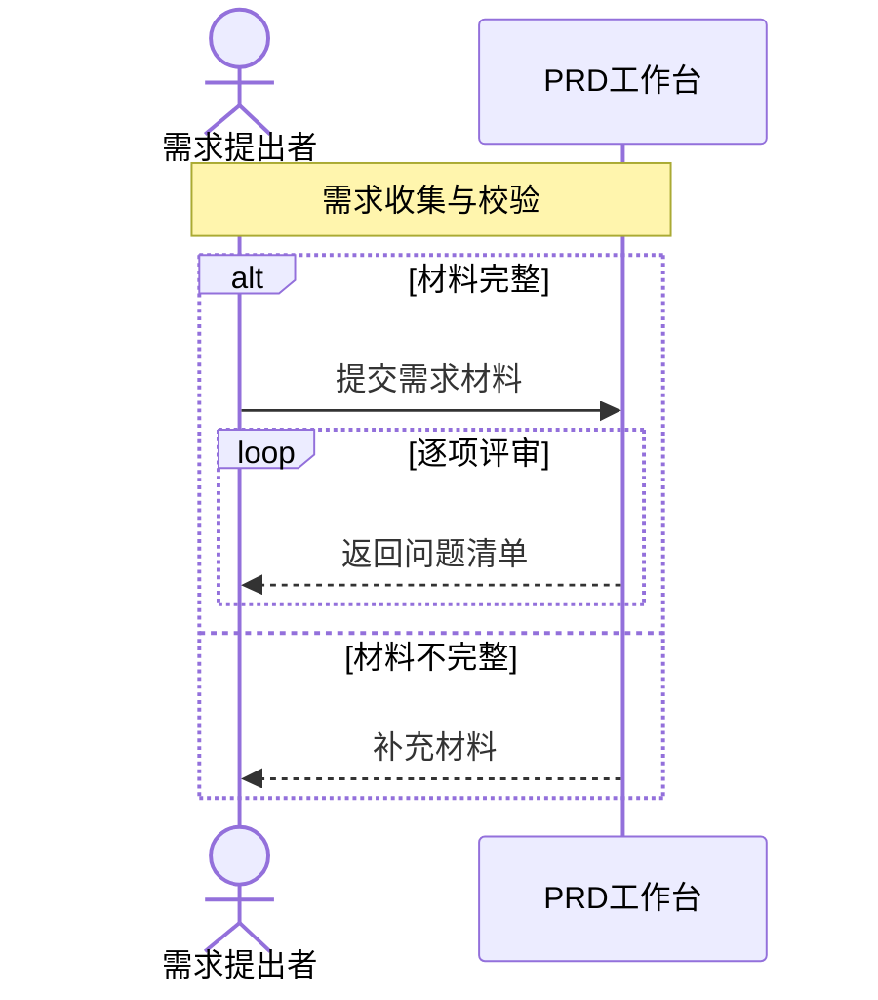

# 合成 PRD：申请材料评审

此材料只用于渲染验收，不代表任何客户或实际业务数据。

## 流程图

```mermaid
flowchart TD
  A[提交申请] --> B{审核通过?}
  B -->|通过| C[生成文档]
  B -->|退回| A
```

## 时序图

```mermaid
sequenceDiagram
  actor U as 需求提出者
  participant W as PRD工作台
  Note over U,W: 需求收集与校验
  alt 材料完整
    U->>W: 提交需求材料
    loop 逐项评审
      W-->>U: 返回问题清单
    end
  else 材料不完整
    W-->>U: 补充材料
  end
```
